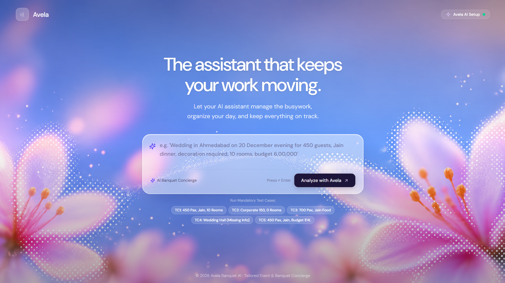
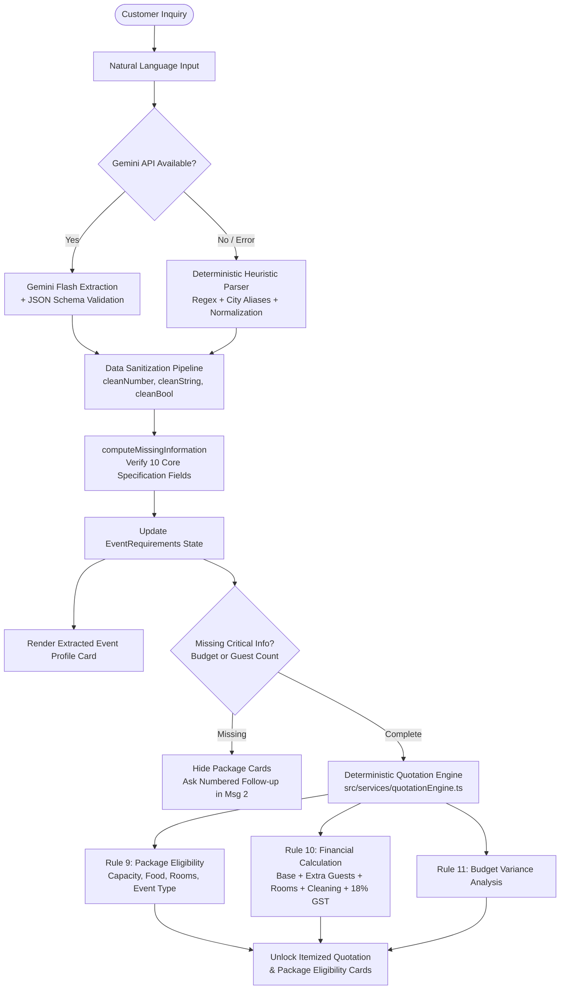

# Avela AI · Luxury Banquet & Event Intelligence Platform

> An exclusive, AI-orchestrated banquet concierge and deterministic quotation engine for luxury celebration and corporate venue bookings.  
> **Created by [Harsh Rathod](https://harshrathod-portfolio.vercel.app/)**

[](https://www.typescriptlang.org/)
[](https://reactjs.org/)
[](https://vitejs.dev/)
[](https://tailwindcss.com/)
[](https://www.npmjs.com/package/@google/genai)
[](https://harshrathod-portfolio.vercel.app/)
[](https://drive.google.com/file/d/1mCOZJBOhCokfycx09aH6uwQ8H1LQm2xf/view?usp=sharing)

<br />

<p align="center">
  <a href="https://drive.google.com/file/d/1mCOZJBOhCokfycx09aH6uwQ8H1LQm2xf/view?usp=sharing" target="_blank">
    
  </a>
  <br />
  <sub>🎬 <b><a href="https://drive.google.com/file/d/1mCOZJBOhCokfycx09aH6uwQ8H1LQm2xf/view?usp=sharing" target="_blank">Click here to watch the full Video Demo on Google Drive</a></b></sub>
</p>

---

## 1. Project Overview

**Avela AI** is an intelligent banquet discovery and quotation system designed to bridge the gap between unstructured customer inquiries and rigid venue booking requirements. Built with an exclusive luxury concierge persona (**Avela**), the application interprets complex customer requests, validates constraints against curated banquet packages, detects missing information, and deterministically calculates itemized quotations with exact statutory taxes.

- 🎬 **Video Demo:** [Watch Full Demo Video on Google Drive](https://drive.google.com/file/d/1mCOZJBOhCokfycx09aH6uwQ8H1LQm2xf/view?usp=sharing)

---

## 2. Problem Being Solved

Organizing weddings, banquets, and corporate conferences traditionally suffers from high friction:
- **Unstructured Customer Inputs:** Customers inquire using colloquial phrasing, abbreviations (`pax`, `sept`, `lakhs`), and spelling variations (`ahemdabad`, `shaadi`).
- **Tedious Follow-Up Cycles:** Venue coordinators spend days asking basic qualification questions (guest count, dietary needs, room requirements, dates).
- **Calculation Errors & Hallucinations:** When AI chatbots are asked to calculate prices, they frequently hallucinate rates, discounts, tax figures, or capacity allowances, causing commercial disputes.
- **Premature Package Display:** Presenting packages before knowing whether a venue can accommodate the guest count or dietary needs wastes time and creates misleading expectations.

**Avela's Solution:**
1. Uses LLMs strictly for **semantic intent extraction** and conversational engagement.
2. Keeps all **package rules, capacity checks, inventory limits, and quotation math 100% deterministic**.
3. Only unlocks itemized quotations and package recommendations once core criteria (guest count and budget) are validated.

---

## 3. Technology Stack

- **Frontend Framework:** React 18 + TypeScript (Strict Type Safety)
- **Bundler & Tooling:** Vite 5
- **Styling:** Vanilla CSS + Tailwind CSS (Curated luxury dark glassmorphism aesthetic)
- **Typography:** Google Fonts (`DM Sans`, weights strictly $\le 500$)
- **Icons:** Lucide React
- **AI Integration:** Official `@google/genai` SDK (Google Gemini Flash Models)
- **Deterministic Math Engine:** Pure TypeScript quotation and eligibility calculation pipeline

---

## 4. Setup Instructions

### Prerequisites
- [Node.js](https://nodejs.org/) (v18.0.0 or higher recommended)
- `npm` or `pnpm`

### Installation Steps

1. **Clone the repository:**
   ```bash
   git clone https://github.com/panduthegang/Avela-AI.git
   cd Avela-AI
   ```

2. **Install project dependencies:**
   ```bash
   npm install
   ```

3. **Configure Environment Variables:**
   Copy the example environment file and add your Gemini API key:
   ```bash
   cp .env.example .env
   ```
   Edit `.env` and add your key:
   ```env
   VITE_GEMINI_API_KEY=your_actual_gemini_api_key_here
   ```

4. **Start the local development server:**
   ```bash
   npm run dev
   ```
   Open your browser and navigate to `http://localhost:5173`.

5. **Build for Production:**
   ```bash
   npm run build
   ```

---

## 5. Environment Variables Required

| Variable | Required | Description | Example |
|---|---|---|---|
| `VITE_GEMINI_API_KEY` | Recommended | Google Gemini API Key for semantic intent extraction. If omitted, Avela seamlessly falls back to its built-in local deterministic heuristic engine. | `AIzaSyD...` |

> **Note:** The application includes a full offline deterministic fallback engine. Even without an API key, all test inquiries and multi-turn conversations can be analyzed smoothly.

---

## 6. Architecture & Data Flow



### End-to-End Pipeline
1. **Customer Enquiry:** Raw text entered on Hero or Chat interface.
2. **AI & Deterministic Extraction:** Normalized into 10 structured fields (`eventType`, `city`, `date`, `time`, `guestCount`, `foodType`, `meal`, `decorationRequired`, `roomsRequired`, `budget`).
3. **Missing Info Identification:** Dynamic validation against business rules.
4. **Follow-Up Generation:** Follow-up questions are strictly presented in Message 2 directly above the chat composer for optimal scrolling UX.
5. **Deterministic Package Eligibility:** Verifies 5 prototype packages (Classic Wedding, Premium Wedding, Royal Wedding, Corporate Basic, Corporate Premium).
6. **Deterministic Quotation & Tax Calculation:** Calculates base fees, extra guest increments, room charges, cleaning fees, and 18% GST.
7. **Budget Variance Analysis:** Mathematically compares actual total against customer budget.

---

## 7. AI Integration Approach

- **Strict Identity Enforcement:** The AI is instructed through `AVELA_SYSTEM_INSTRUCTION` to strictly identify as **Avela** (Luxury Banquet Concierge). It is forbidden from mentioning Gemini, Google, LLMs, or prompt mechanics.
- **Decoupled Architecture:** The LLM is never given access to calculate package prices or alter package constraints. It is solely used for:
  - Extracting unstructured human intent into rigid JSON schema.
  - Formulating warm, sophisticated, context-aware follow-up replies.
- **Multi-turn Context Resolution:** As customers provide follow-up information (`"mumbai, 26 sept 2026, 100 guest, jain, 10 lakhs, 10 rooms"`), previous constraints are preserved while new ones are merged.
- **Dual-Layer Extraction:** Every AI response is augmented with a local deterministic entity extractor (`extractUpdatesFromText`), ensuring that even if an LLM drops a field, the code guarantees 100% extraction accuracy.

---

## 8. AI Tools Used During Development

- **Google DeepMind Antigravity AI Engine:** Used for pairing, architectural structuring, rapid test case implementation, and refactoring.
- **Google GenAI SDK (`@google/genai`):** Official modern SDK used for structured JSON generation with Gemini models.
- **Gemini 2.5 Flash / Flash-Lite:** Chosen for near-instant inference speed (<1s), low token cost, and strict JSON schema adherence.

---

## 9. Validation & Error-Handling Approach

| Layer | Threat | Mitigation Strategy |
|---|---|---|
| **API Transport** | Rate limits (HTTP 429), timeouts, 503 errors | `try-catch` blocks around all API calls; automatic failover to local fallback parser. |
| **JSON Syntax** | Malformed JSON or unexpected markdown code blocks | Defensive regex cleaning (`replace(/^```json/, '')`) before parsing. |
| **Data Types** | LLM outputs strings for numbers or floating decimals | `sanitizeRequirements` pipeline: `cleanNumber` rounds and validates positive integers; `cleanString` filters `'unknown'` and `'null'`. |
| **Logic & Math** | Hallucinated prices or inconsistent taxes | 100% code-driven quotation engine ([`quotationEngine.ts`](file:///c:/Users/LENOVO/Documents/Avela-AI/src/services/quotationEngine.ts)). |
| **Typos & Formatting** | Phonetic misspellings (`ahemdabad`, `amdavad`, `sept`) | Pre-configured `CITY_ALIASES` map and `normalizeDateString` month mapping. |
| **Regex Collisions** | Strings like `"10 rooms"` matching zero-room regex (`0 rooms`) | Prioritizing positive number regexes first and applying strict word boundaries (`\b0\b`). |

---

## 10. Known Limitations

1. **Client-Side API Key Architecture:**
   - In this prototype, calls to Gemini originate directly from the browser client using Vite environment variables. While suitable for prototypes and demos, production applications require a server-side Backend-For-Frontend (BFF) proxy to prevent client-side key exposure.
2. **Fixed Prototype Package Catalog:**
   - The 5 packages (Classic Wedding, Premium Wedding, Royal Wedding, Corporate Basic, Corporate Premium) are static TypeScript structures rather than database-driven records.
3. **Simulated Inventory Availability:**
   - Venue dates and room availability are evaluated against package capacity constraints rather than syncing with a live property management system (PMS) like Opera or Google Calendar.
4. **Single Currency:**
   - The pricing engine is calibrated strictly for Indian Rupee (INR / ₹) and standard Indian event planning structures (Lakhs, Jain catering, Banquet Hall + Lawn).

---

## 11. What We Would Improve With Another Day

With an additional day of development, the following enhancements would be prioritized:

1. **Backend-For-Frontend (BFF) Proxy:**
   - Build a lightweight Node.js/FastAPI proxy endpoint with server-side authentication, rate limiting, and request throttling to keep API credentials fully server-side.
2. **Multi-Tenant Database Integration (PostgreSQL + Prisma):**
   - Move packages from static files to a relational database schema supporting multiple venue properties, customizable seasonal rates, and hall layouts.
3. **Calendar & Live PMS Integration:**
   - Integrate with Google Calendar or venue ERPs to perform real-time date availability checking and place actual tentative booking holds.
4. **Automated End-to-End Test Suite:**
   - Implement automated Vitest unit tests for all deterministic quotation edge cases and Playwright tests for the 5 mandatory benchmark user journeys.
5. **Interactive Venue Floorplan & Photo Tour:**
   - Provide interactive 3D or visual floorplan selections directly inside the quotation card, allowing customers to preview hall seating arrangements.
6. **PDF Quotation Generator:**
   - Add a one-click *"Download Official Luxury Quotation PDF"* button featuring Avela's branded letterhead, itemized pricing breakdown, terms, and payment milestones.

---

## Author & Developer

**Harsh Rathod**
- **Portfolio:** [https://harshrathod-portfolio.vercel.app/](https://harshrathod-portfolio.vercel.app/)

---

## License

This project is licensed under the [MIT License](LICENSE).
